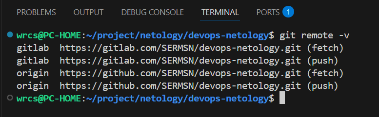
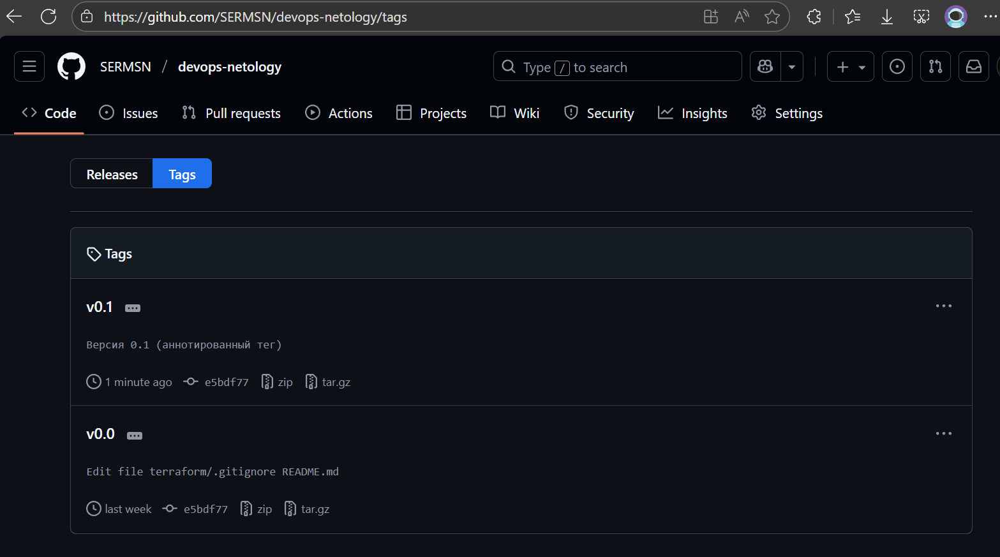
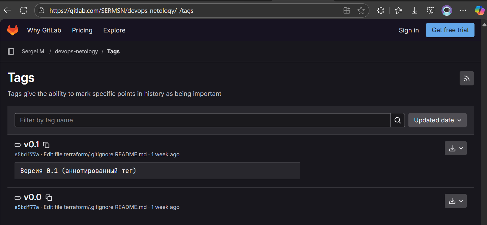
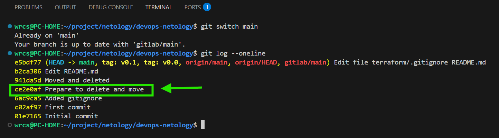
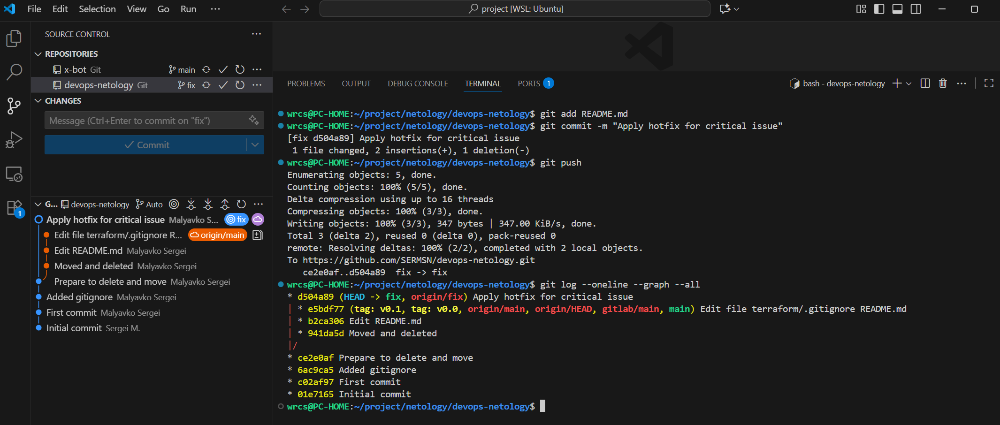
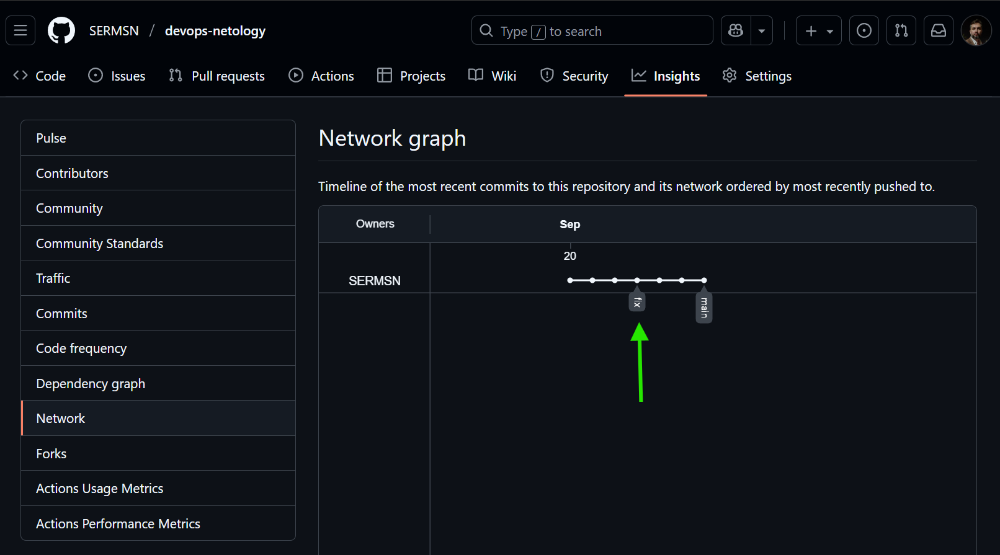
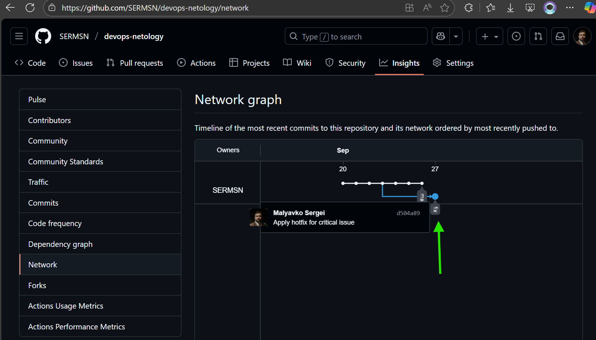

# Отчет по выполнению домашнего задания «Основы Git»

## Введение

В ходе выполнения задания были освоены навыки работы с Git как с распределенной системой контроля версий, включая настройку работы с несколькими удаленными репозиториями, работу с тегами и ветками.

## Задание 1. Знакомимся с GitLab

### Выполненные действия:

1. **Проверка текущей конфигурации remote-репозиториев**
   
   Перед добавлением нового remote-репозитория была проверена текущая конфигурация:
   ```bash
   git remote -v
   ```

   *Результат: Настроена связь только с GitHub репозиторием (origin)*

2. **Добавление GitLab как дополнительного remote-репозитория**

   Добавлен новый remote с именем `gitlab`:
   ```bash
   git remote add gitlab https://gitlab.com/SERMSN/devops-netology.git
   ```

3. **Синхронизация кода с GitLab**

   Выполнена отправка кода в GitLab репозиторий:
   ```bash
   git push -u gitlab main
   ```

4. **Проверка обновленной конфигурации**

   После выполнения операций конфигурация remote-репозиториев обновилась:
   
   

   *Результат: Локальный репозиторий настроен на работу с двумя удаленными репозиториями*

**Ссылка на репозиторий GitLab:** https://gitlab.com/SERMSN/devops-netology

## Задание 2. Теги

### Выполненные действия:

1. **Создание легковесного тега v0.0**
   ```bash
   git tag v0.0
   git push origin v0.0
   git push gitlab v0.0
   ```

2. **Создание аннотированного тега v0.1**
   ```bash
   git tag -a v0.1 -m "Версия 0.1 (аннотированный тег)"
   git push origin v0.1
   git push gitlab v0.1
   ```

3. **Сравнение тегов в веб-интерфейсах**

   **GitHub:**
   
   
   *В GitHub оба тега отображаются как релизы, причем аннотированный тег v0.1 содержит описание*

   **GitLab:**
   
   
   *В GitLab также видны оба тега, с аннотацией для v0.1*

## Задание 3. Ветки

### Выполненные действия:

1. **Поиск целевого коммита**

   Выполнен поиск коммита "Prepare to delete and move" для создания ветки:
   ```bash
   git log --oneline
   ```
   
   

2. **Создание ветки fix**

   Создана новая ветка `fix` от найденного коммита:
   ```bash
   git switch -c fix ccdadmf
   ```

3. **Внесение изменений в ветке fix**

   В файл README.md добавлена новая строка и изменения зафиксированы:
   
   

4. **Отправка ветки в удаленный репозиторий**
   ```bash
   git push -u origin fix
   ```

5. **Визуализация ветвления в GitHub**

   Проверка схемы коммитов в веб-интерфейсе GitHub:
   
   
   *Состояние до отправки изменений*
   
   
   *Состояние после отправки ветки fix - видно ответвление от основного ствола*

## Задание 4. Упрощаем себе жизнь

Для работы с Git взял IDE VSCode (т.к. уже работаю в нем и переучиваться на PyCharm времени нет и нецелесобразно).

В VSCode всё что необходимо для работы с Git есть, в плодь до графического представления ветвлений.


## Результаты выполнения

### Ссылки на репозитории:
- **GitHub:** https://github.com/SERMSN/devops-netology
- **GitLab:** https://gitlab.com/SERMSN/devops-netology

### Выводы:
- Успешно настроена работа с двумя удаленными репозиториями (GitHub и GitLab)
- Освоены методы создания и управления тегами разных типов
- Получен практический опыт работы с ветвлением в Git
- Визуализирован процесс разработки через сетевые графики коммитов
- Закреплен навык работы с IDE VSCode