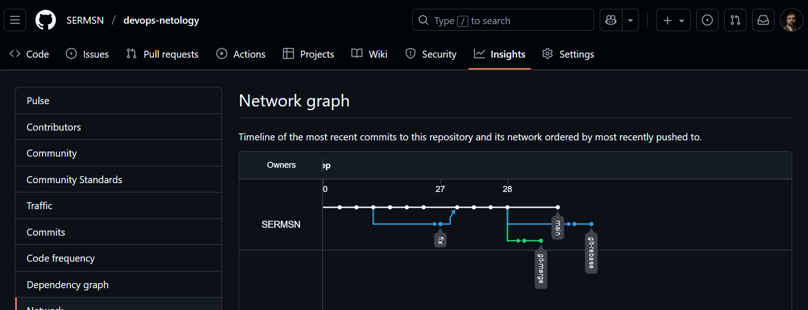
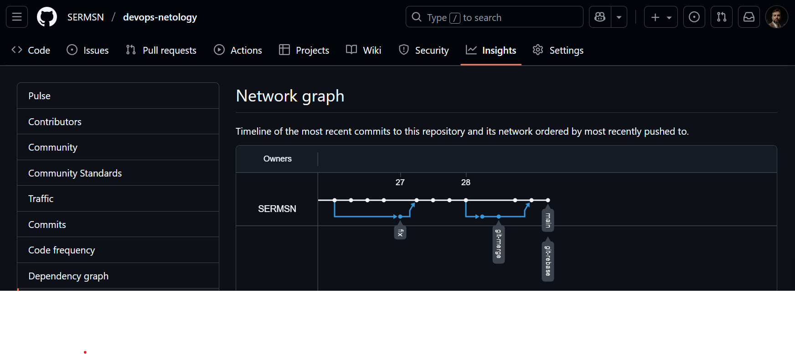

# Отчет по выполнению задания «Ветвления в Git»

## Цель задания
Освоить работу с ветвлениями в Git, научиться выполнять операции `merge` и `rebase`, понимать разницу между ними и уметь разрешать конфликты.

## Выполнение задания

### Шаг 1: Подготовка базовой структуры

Создал каталог `branching` и два файла с одинаковым содержимым:

```bash
mkdir branching
cat > branching/merge.sh << EOF
#!/bin/bash
# display command line options

count=1
for param in "\$*"; do
    echo "\\\$* Parameter #\$count = \$param"
    count=\$(( \$count + 1 ))
done
EOF

cat > branching/rebase.sh << EOF
#!/bin/bash
# display command line options

count=1
for param in "\$*"; do
    echo "\\\$* Parameter #\$count = \$param"
    count=\$(( \$count + 1 ))
done
EOF
```

### Шаг 2: Первый коммит в main

Выполнил коммит с описанием "prepare for merge and rebase":

```bash
git add branching/
git commit -m "prepare for merge and rebase"
git push origin main
```


### Часть 1: Работа с веткой git-merge

#### Шаг 1: Создание ветки git-merge
```bash
git checkout -b git-merge
```

#### Шаг 2-3: Первое изменение в merge.sh
Заменил `$*` на `$@` в файле `merge.sh`:

```bash
cat > branching/merge.sh << EOF
#!/bin/bash
# display command line options

count=1
for param in "\$@"; do
    echo "\\\$@ Parameter #\$count = \$param"
    count=\$(( \$count + 1 ))
done
EOF

git add branching/merge.sh
git commit -m "merge: @ instead *"
git push -u origin git-merge
```

#### Шаг 4-5: Второе изменение в merge.sh
Заменил цикл `for` на `while` с использованием `shift`:

```bash
cat > branching/merge.sh << EOF
#!/bin/bash
# display command line options

count=1
while [[ -n "\$1" ]]; do
    echo "Parameter #\$count = \$1"
    count=\$(( \$count + 1 ))
    shift
done
EOF

git add branching/merge.sh
git commit -m "merge: use shift"
git push origin git-merge
```

### Часть 2: Изменения в main

#### Шаг 1-3: Внесение изменений в rebase.sh в main
Вернулся в main и обновил файл `rebase.sh`:

```bash
git checkout main

cat > branching/rebase.sh << EOF
#!/bin/bash
# display command line options

count=1
for param in "\$@"; do
    echo "\\\$@ Parameter #\$count = \$param"
    count=\$(( \$count + 1 ))
done

echo "====="
EOF

git add branching/rebase.sh
git commit -m "main: update rebase.sh to use @ and add separator"
git push origin main
```

### Часть 3: Работа с веткой git-rebase

#### Шаг 1: Создание ветки от начального коммита
Нашел хеш коммита "prepare for merge and rebase" и создал ветку от него:

```bash
git log --oneline
# Нашел хеш коммита (в моем случае 64c597f)
git checkout 64c597f
git checkout -b git-rebase
```

#### Шаг 2-3: Первое изменение в rebase.sh
```bash
cat > branching/rebase.sh << EOF
#!/bin/bash
# display command line options

count=1
for param in "\$@"; do
    echo "Parameter: \$param"
    count=\$(( \$count + 1 ))
done

echo "====="
EOF

git add branching/rebase.sh
git commit -m "git-rebase 1"
git push -u origin git-rebase
```

#### Шаг 4-5: Второе изменение в rebase.sh
```bash
cat > branching/rebase.sh << EOF
#!/bin/bash
# display command line options

count=1
for param in "\$@"; do
    echo "Next parameter: \$param"
    count=\$(( \$count + 1 ))
done

echo "====="
EOF

git add branching/rebase.sh
git commit -m "git-rebase 2"
git push origin git-rebase
```

### Промежуточный результат: Network Graph

На этом этапе граф репозитория показывает три ветки:
- `main` с обновленным rebase.sh
- `git-merge` с двумя коммитами изменений merge.sh
- `git-rebase` с двумя коммитами, ответвляющимися от начального коммита



### Часть 4: Слияние ветки git-merge в main (Merge)

#### Шаг 1-2: Выполнение merge
```bash
git checkout main
git merge git-merge
git push origin main
```

Слияние прошло автоматически, так как файлы изменялись независимо.


### Часть 5: Слияние ветки git-rebase в main (Rebase)

#### Шаг 1: Начало интерактивного rebase
```bash
git checkout git-rebase
git rebase -i main
```

В интерактивном режиме изменил второй коммит с `pick` на `fixup` для объединения коммитов.

#### Шаг 2: Разрешение первого конфликта
Git остановился на первом конфликте в файле `rebase.sh`:


Вручную отредактировал файл, оставив версию из main:
```bash
echo "\$@ Parameter #$count = $param"
```

```bash
git add branching/rebase.sh
git rebase --continue
```

#### Шаг 3: Разрешение второго конфликта
Git остановился на втором конфликте. Отредактировал файл, оставив версию из второго коммита:
```bash
echo "Next parameter: $param"
```

```bash
git add branching/rebase.sh
git rebase --continue
```

#### Шаг 4: Завершение rebase и принудительный пуш
После разрешения конфликтов rebase завершился успешно:

```bash
git push origin git-rebase -f
```

#### Шаг 5: Fast-forward merge в main
```bash
git checkout main
git merge git-rebase
git push origin main
```

### Финальный результат

Все изменения успешно объединены в ветке main. Network Graph наглядно демонстрирует разницу между подходами:

- Ветка `git-merge` влилась через merge-коммит
- Ветка `git-rebase` была перебазирована и влилась линейно



## Выводы

В ходе выполнения задания:
1. Освоил создание веток и работу с ними
2. На практике изучил разницу между `merge` и `rebase`:
   - **Merge** сохраняет историю всех коммитов и создает merge-коммит
   - **Rebase** перезаписывает историю, создавая линейную последовательность коммитов
3. Научился разрешать конфликты при слиянии
